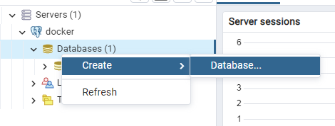

# Introduction

This project as part of assessment work of "Java Enterprise Edition" course. After two month I'm looking on this project, and It's awful. There are so many things that I can do better, but let it be. It's my first web project.<br>
The idea of the project is to develop a simple web application that allows you to practice basic arithmetic, like 2+2 :)<br>
As part of assessment I had to develop some web application that works with 3d party REST API. I choose <a href='https://x-math.herokuapp.com/'>xMath API</a>. Read more on <a href='https://x-math.herokuapp.com/'>home page</a>.

# Technologies
Programming language: Java<br>
Technology stack: JavaEE (servlets)<br>
Database: Postgres<br>

# xMath API
*I'm not an author of next text and/or xMath api. Text copied from https://x-math.herokuapp.com/. Author of API is <a href='https://github.com/cheatsnake/xMath-api.git'>cheatsnake (GitHub)</a>.

## Inspirations
I've always liked math, so one of my open source projects was an oral counting simulator. To do this, I wrote code that generates random expressions right inside the application. Now, I decided to separate the application logic and make a free API out of it so that you can create your cool apps.

## How to use it?
The API provides you with the ability to get a random expression with mathematical operations such as addition, subtraction, multiplication or division. You get an object containing two numbers, an operation sign, and the result of an expression.<br>
You can choose the operation you need or get a random operation.

### Random expression
```
https://x-math.herokuapp.com/api/random
```

### Only addition
```
https://x-math.herokuapp.com/api/add
```

### Only subtraction
```
https://x-math.herokuapp.com/api/sub
```

### Only multiplication
```
https://x-math.herokuapp.com/api/mul
```

### Only division
```
https://x-math.herokuapp.com/api/div
```

## Parameters
By default, the range of numbers from 1 to 99 is set for all expressions. But you can adjust the range (for any operation) yourself using the parameters.

### Range of generated numbers
The max and min parameters change the possible range for each number in the expression.
```
?max=999&min=100
```
The maxFirst and minFirst parameters change the possible range only for the first number (the second number uses the default value).

```
?maxFirst=256&minFirst=128
```
The maxSecond and minSecond parameters change the possible range only for the second number (does not affect division, because there the second number is randomly selected from the list of divisors of the first number).

```
?maxSecond=256&minSecond=128
```

### Negative result
To get expressions that result in negative numbers, you can change the range of values using the parameters described above by adding negative numbers there.<br>
But this will not work for the subtraction operation, because by default there the first number is always greater than the second. To fix this, you can use the parameter negative in the value 1.
```
https://x-math.herokuapp.com/api/sub?negative=1
```

### Examples
```
https://x-math.herokuapp.com/api/random?max=999&negative=1
https://x-math.herokuapp.com/api/mul?maxFirst=999&maxSecond=20
https://x-math.herokuapp.com/api/add?max=500&minFirst=100
```

# Deployment
To deploy this project you should have to do everything from scratch :))))<br>
That's not true, but you should manage and config a lot of things.

## Copy repo
```
git clone https://github.com/greentech72/JMT.git
```

## Build war archive

### Install corretto 11
<a href='https://docs.aws.amazon.com/corretto/latest/corretto-11-ug/generic-linux-install.html'>Amazon Corretto 11 Installation Instructions for Debian-Based, RPM-Based and Alpine Linux Distributions</a>
```
wget -O- https://apt.corretto.aws/corretto.key | sudo apt-key add -
sudo add-apt-repository 'deb https://apt.corretto.aws stable main'
sudo apt-get update; sudo apt-get install -y java-11-amazon-corretto-jdk
```

### Verify installation
```
java --version
```

Expected:
```
openjdk version "11.0.16" 2022-07-19 LTS
OpenJDK Runtime Environment Corretto-11.0.16.8.1 (build 11.0.16+8-LTS)
OpenJDK 64-Bit Server VM Corretto-11.0.16.8.1 (build 11.0.16+8-LTS, mixed mode)
```

### Install maven
```
sudo apt install maven
```

### Verify maven
```
mvn --version
```

Expected:
```
Apache Maven 3.6.3
Maven home: /usr/share/maven
Java version: 11.0.16, vendor: Amazon.com Inc., runtime: /usr/lib/jvm/java-11-amazon-corretto
Default locale: en, platform encoding: UTF-8
OS name: "linux", version: "5.15.0-41-generic", arch: "amd64", family: "unix"
```

### Build WAR
```
cd JMT
mvn clean package
```

If build successful you would be able to find JMT-1.0-SNAPSHOT.war in your target dir.

## Run docker
As a deployment system a used docker (also my first experience). Everything for deploy located in compose.yml file.
```
docker-compose up
```

## Create database (yeah, manually)
When you started docker containers you will have access to pgAdmin on port 80 of your host. Then you should enter your email and password information (found in compose.yml).

Then you need to add new server of db:<br>
<br>


Then add new database: <br>
<br>


And then execute scripts from <a href="src/main/resources/create_table.sql">src/main/resources/create_table.sql</a>:
```sql
DROP TABLE session;
DROP TABLE account;

CREATE TABLE account (
	user_id SERIAL PRIMARY KEY,
	email VARCHAR(255) UNIQUE NOT NULL,
	username VARCHAR(63) UNIQUE NOT NULL,
	password VARCHAR(63) NOT NULL,
	date_of_registration DATE NOT NULL,
	photo VARCHAR(255)
);

CREATE TABLE session (
	session_id SERIAL PRIMARY KEY,
	user_id INT,
	date DATE NOT NULL,
	time TIME NOT NULL,
	FOREIGN KEY(user_id) REFERENCES account (user_id)
);

ALTER TABLE session ADD COLUMN speed FLOAT;
ALTER TABLE session ADD COLUMN experience FLOAT;
ALTER TABLE account ADD COLUMN experience FLOAT DEFAULT(1);
```

Result:<br>


### Create images folder (yeah, I messed up)
```
docker exec -it jmt-tomee-server bash
cd webapps/JMT
mkdir images
exit
```

### Finally
After that you can access JMT through: hostname:8080/JMT

# User experience
User experience is more friendly than deployment. After you access web application main page will be displayed:


## Register
From here you can register new account:

<br>
*note that JMT stores your Username, Email and Password in not encrypted manner, so be extra careful.

After you entered all fields (you can ignore photo selection)


## After registration


## Personal page:


## Play
After you hit play it may take some time to load actual tests but be patient


## Experience system
If X is experience then level is function of square root of experience (LVL = sqrt(EX))

After a couple of games you will get some level apps:


## Statistic page
From your personal page you can access your statistic page

<br>
There you will find all sessions that you played sorted by date. Each session contains information on how fast have you solved all puzzles and amount of experience to get.

# Mistakes
List of mistakes of this project
<ul>
    <li>Deployment process is awful. I'm glad that I used docker, it's much easier but still it's pretty bad</li>
    <li>It would be great to build application when docker-compouse called</li>
    <li>Not enough tests. There are no user-oriented tests</li>
    <li>No custom error pages</li>
    <li>No data protection. PGAdmin shouldn't be accessible via public url. Passwords should be stored in encrypted manner.</li>
    <li>Database creation process should be automated (well, for test purpose 110%)</li>
    <li>Slow API (not my problem, that what task was, but still).</li>
</ul>

# Conclusion
As a result fully operating basic <b>Java-Math-Test</b> game was developed. A lot of JavaEE technologies were studied: work with JSON, servlets, .jsp, etc.<br>
I got A (100/100) so basically I did well.
